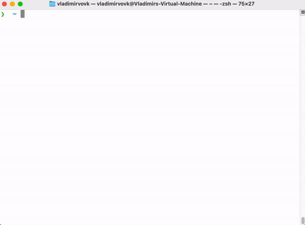

<h1 align="center">
env-setup
</h1>

Bootstrap you dev environment in minutes instead of hours! 🛠️

</img>

## Quick Start

1. Open your favourite terminal.
2. Change to home directory: `cd`.
3. Clone the repo: `git clone git@github.com:vladimir-vovk/env-setup.git`.
4. Change to `scripts` directory: `cd env-setup/scripts`.
5. Run a particular script or run the `./_setup-all_.sh` to setup everything at once.

## Directory Structure

- `dotfiles` - configuration files.
- `scripts` - setup scripts.

